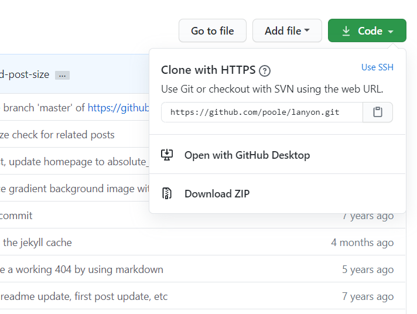

### 테마 선택하기
[lanyon 테마](https://github.com/poole/lanyon)를 선택했다.  


### 소스 다운받기
<!-- 이미지 수정하기 -->

주소를 복사해 clone하거나 zip 파일 형태로 다운받으면 된다.

나는 clone을 통해 다운받았다.

```bash
git clone https://github.com/poole/lanyon.git
```  


### 소스 옮기기
다운받은 폴더로 가서 폴더 안의 파일들을 모두 복사해서 자신의 블로그 파일에 붙여넣기 한다.  


### _config.yml 파일 수정하기
설정 정보를 가지는 _config.yml 파일로 가서 title, url 등 블로그에 대한 정보를 수정한다.
- `url: 블로그 주소`
- `baseurl: ''`

```
url:                 "https://seonjuleee.github.io"
baseurl:             ''
```  


### commit 후 push
```bash
git add .
git commit -m "commit message"
git push -u origin master
```
  