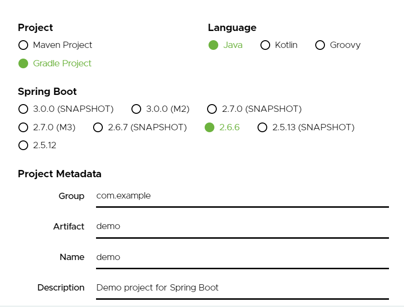
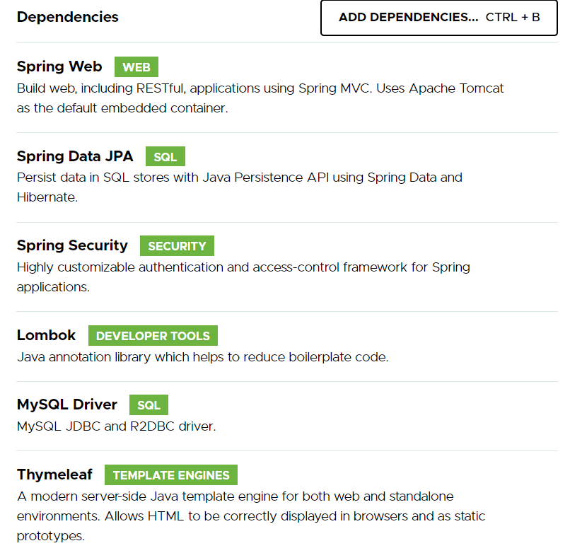

스프링부트 프로젝트를 간단하게 생성해보자.

### 1. Spring Initializr 홈페이지 들어가기
[Spring Initializr](https://start.spring.io/)에 들어가면 스프링부트 프로젝트를 생성할 수 있다.

### 2. 프로젝트 정보 입력

개발할 프로젝트에 관해 정보를 입력하면 된다.

#### Project
Maven, Gradle은 프로젝트 라이브러리 및 빌드를 관리할 수 있는 툴이다. Gradle이 더 간편하기 때문에 요즘 많이 사용되고 있다. 나는 `Gradle Project`로 지정하였다.

#### Language
자바 프로젝트이기 때문에 Java를 선택했다.

#### Spring Boot Version
선택할 수 있는 버전이 다양한데, `SNAPSHOT`은 현재 개발 중인 버전, `M`은 정식으로 릴리즈되지 않은 버전이다.
아무것도 붙어있지 않은 버전이 정식 릴리즈된 버전이므로, 정식 릴리즈 버전 중 가장 최신 버전을 선택하였다.

#### Project Metadata
프로젝트 이름을 지정하면 된다. `Group`은 보통 기업 도메인명, `Artifact`는 빌드 결과물 이름을 작성하는데, 개인 프로젝트의 경우에는 `Group`은 블로그나 본인을 식별할 수 있는 이름으로, `Artifact`는 프로젝트 이름으로 지정하면 된다.

### 3. Dependency 추가
추가할 라이브러리 및 툴 등을 선택하는 항목이다.

내가 추가한 항목은 다음과 같다.
- `Spring Web`
- `Spring Data JPA` : JPA를 편리하게 사용할 수 있는 기능
- `Spring Security` : 스프링 기반 보안 및 인증 담당
- `Lombok` : Getter와 Setter, Constructor를 어노테이션으로 간편하게 만들어주는 기능
- `MySQL Driver`
- `Thymeleaf` : Controller가 전달하는 데이터를 View에서 동적으로 화면을 구성할 수 있도록 하는 템플릿

여기서 선택할 수도 있지만 프로젝트 생성 후에도 build.gradle 파일에서 Dependency를 추가할 수 있다.

### 프로젝트 파일 생성하기

모든 정보 및 의존성을 추가하면, GENERATE 버튼을 눌러 프로젝트를 생성하면 된다. 그러면 .zip파일로 프로젝트 파일이 생성이 되고 파일을 압축해제해 사용하면 된다.