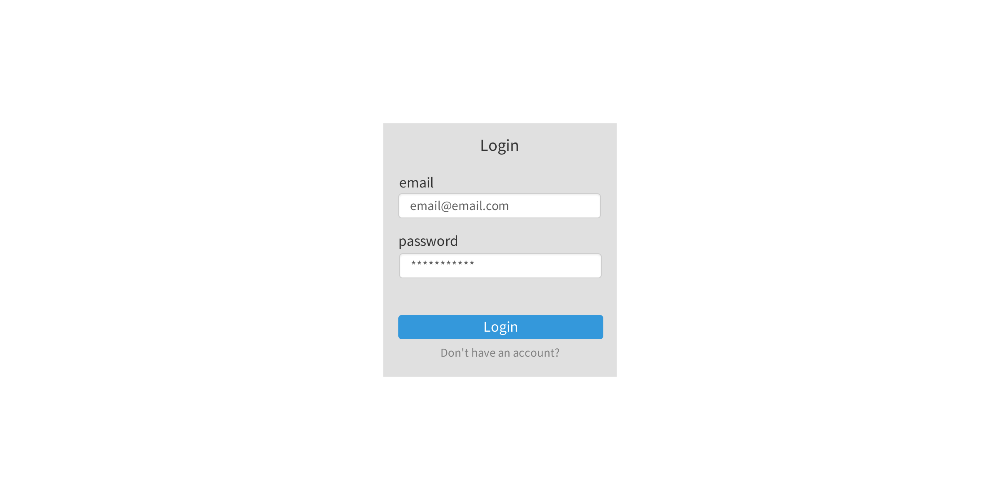

### 기획
저번 주제 선정 때 주요 기능을 적긴 했지만 기획을 하면서 이번에 개발 할 기능을 다시 정리해보았다. 기본적인 기능을 먼저 개발해야한다고 생각하여 주요 기능을 복잡하지 않게 설계하였다.

UI 구성은 [카카오 오븐](https://ovenapp.io/)을 이용해서 구현했다. PPT처럼 주어진 도형을 활용해 드래그로 화면을 구성해볼 수 있어 간편하게 사용이 가능하다. 

대략적인 구조만 나타냈으며, 개발을 진행하면서 Bootstrap을 이용하여 구체적인 부분도 나타낼 것이다.

#### 1. Login
- 회원 가입
- 로그인
- 로그아웃

#### 2. Study List
- 전체 리스트 조회
- 필터링 기능

#### 3. My Study
- 내가 속한 스터디 리스트 조회
- 페이징

#### 4. My Study Detail
- 선택한 스터디 정보 조회
- 스터디에 속한 멤버 조회
- 일정은 화면만 구성, 일정 기능 구현은 나중에 추가할 예정

#### 5. Study Post
- 스터디 내 글쓰기 기능
- 글 조회/추가/수정/삭제

#### 6. Study Post Detail
- 글 조회

### DB 설계
위의 기능을 토대로 DB를 설계하였다.

