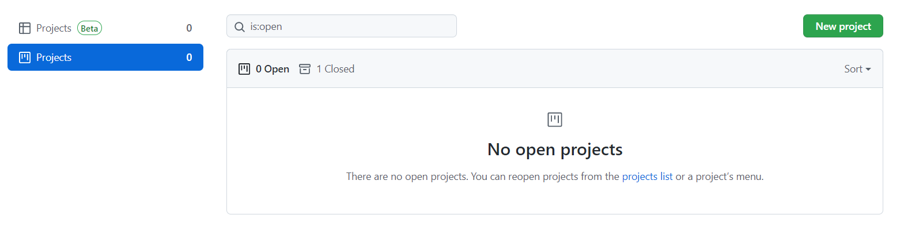
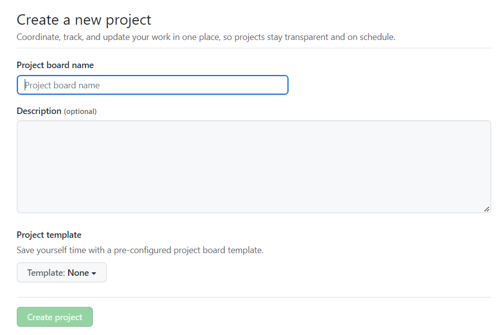
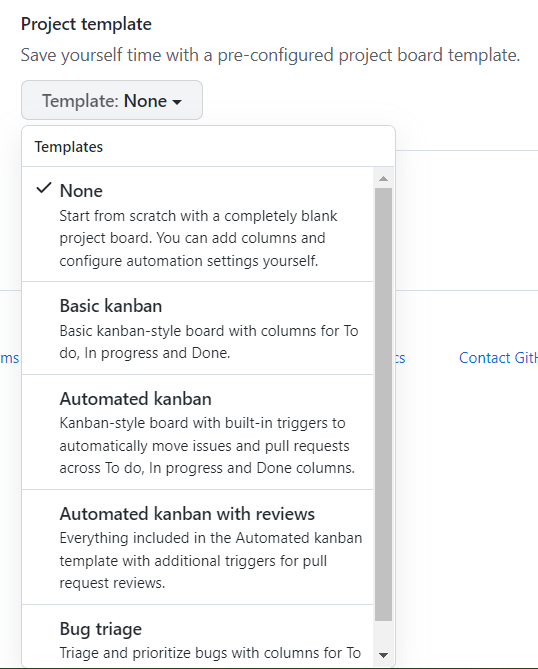
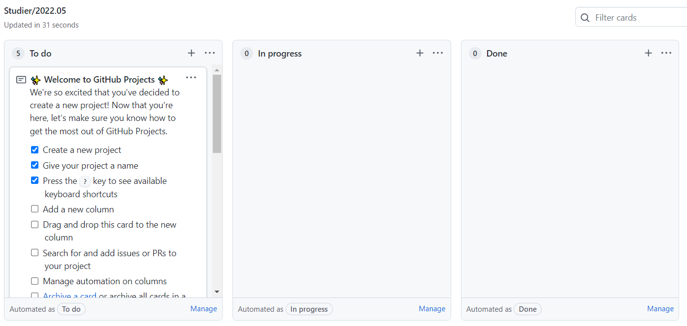
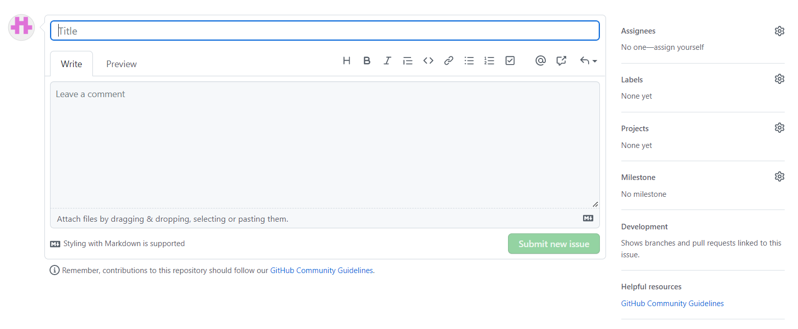
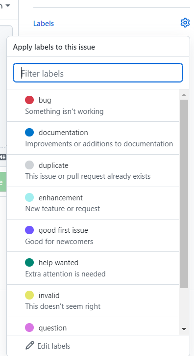
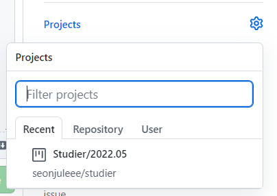
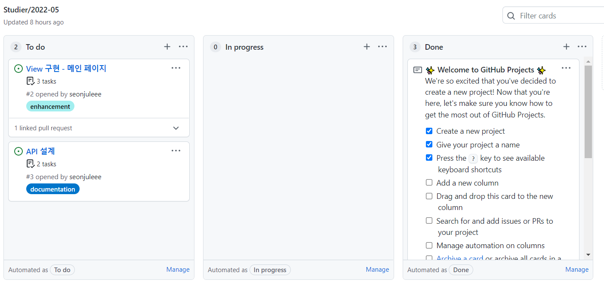

이전부터 Github에 있는 Issue와 Projects 기능을 사용해서 프로젝트를 체계적으로 관리해보고 싶었다. 그래서 현재 진행하고 있는 `Studier` 개인 프로젝트에 적용해보기로 했다.

### Projects
Projects 기능을 사용하여 프로젝트의 작업 현황과 진행도를 알 수 있고, 쉽게 관리 가능하다. 내가 생성한 프로젝트를 관리할 수 있는 칸반 보드라고 생각하면 좋다.

### 1. Project 생성하기

Projects 기능을 사용해서 Issue와 연동시켜보자.

New Project를 클릭한다.

프로젝트 정보(board 이름, 설명)를 기입하면 된다.

템플릿은 `Automated kanban`으로 선택한다. 그래야 Issue와 Pull Request 생성/수정/삭제 시 프로젝트 탭에서도 자동적으로 반영이 가능하다.

프로젝트 생성 완료 후, 생성이 된 프로젝트를 볼 수 있다.

`To do`, `In progress`, `Done`으로 나누어지며, 직접 항목을 구성해볼 수도 있다. 
- To do
  - 작업을 새로 올렸을 때
  - Issue나 Pull Request를 새로 추가할 때
- In progress
  - 작업을 진행 중일 때
  - Issue나 Pull Request를 Open했을 때
- Done
  - 작업을 완료했을 때
  - Issue나 Pull Request를 Close했을 때

### 2. Issue 올리기
Issue를 새로 추가해 좀 전에 만든 Project에 자동적으로 생성될 수 있도록 하자.

다른 부분에는 올릴 이슈에 관한 내용을 올리면 되고, 오른쪽 패널 부분을 보면 Label와 Projects이 있다.

Labels는 작업의 성격을 태그 형태로 달 수 있는 기능이며, 필수 사항은 아니다.

나의 경우, Labels 설명 그대로 문서를 관리하게 될 때는 `documentation`, 새로운 기능을 올릴 때는 `inhancement`를 사용했다.

앞서 생성한 프로젝트와 연동한 경우에는, Projects에 프로젝트를 선택해주면 된다.

### 예시

`Studier` 프로젝트에서 진행될 항목을 Issue에 올린 결과이다.

프로젝트 진행 사항을 한 눈에 볼 수 있고, Label을 통해 진행할 작업의 성격을 쉽게 알 수 있다.

앞으로 이 기능을 사용하여 프로젝트를 체계적으로 관리할 것이며, 추후 팀 프로젝트에도 적용해보고 싶다.

### 참고
- [협업 시 프로젝트(Projects)와 이슈(Issue) 사용하기](https://devlog-wjdrbs96.tistory.com/227)